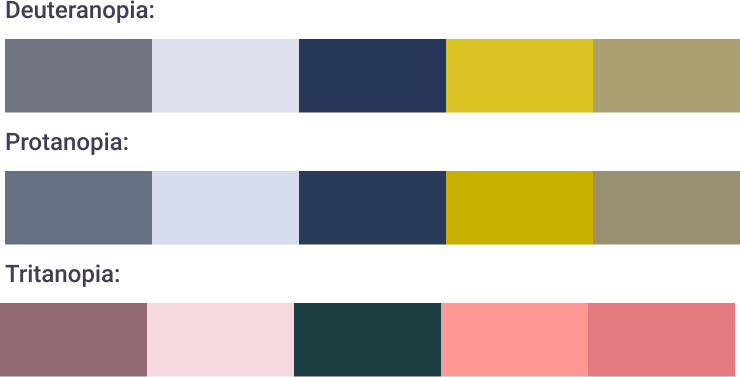
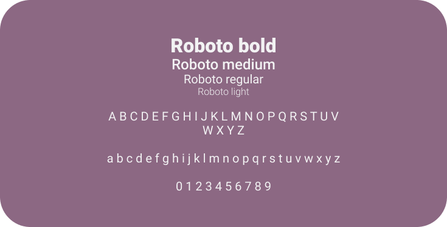

<h1 align="center" id="top"> 💻🙋 Ada Social Network </h1>

<p align="center">
  A social network to integrate women in tech area
  <br>
  ⚡ To access click <a href="https://ada-social-network.web.app">here</a>! ⚡  
</p>

<p align="center">
 <a href="#-challenge">Challenge</a> •
 <a href="#-about">About</a> •
 <a href="#-development">Development</a> • 
 <a href="#-getting-started">Getting Started</a> • 
 <a href="#-build-with">Build With</a> • 
 <a href="#-authors">Authors</a>
</p>

---

## 🎯 Challenge

The challenge in this project was to develop a Social Network that allows any user to create an access account, log in with it, create, edit, delete and give likes to publications. The interface has to be created using the Mobile Frist concept and the app must be developed as a Single-page Application (SPA), using only Vanilla JavaScript, HTML, CSS and Firebase. To know more about the challenge click [here](https://github.com/Laboratoria/SAP005-social-network).

<p align="center">
  </img>
</p>

<p align="right">
  <a href="#top"> Back to the top. </a>
</p>

---

## 💡 About 

The first known programmer in history was Augusta Ada King, better known as [Ada Lovelace](https://pt.wikipedia.org/wiki/Ada_Lovelace), she developed the first algorithm to be read by a machine. Although this place is historically ours, in Brazil only 17% of the jobs opportunities in the TI area were offered to women and 13% of the professionals employed were women in leadership occupancy, according to this [reaserch](https://economia.uol.com.br/noticias/redacao/2020/10/06/mulheres-avancam-na-area-de-tecnologia-mas-diferenca-de-salarios-aumenta.htm?cmpid=copiaecola) (2019). Inspired by Ada biography and our journey, we created a social network for women in tech (or aspiring to) to share support, experiences, opportunities, and knowledge.

<p align="center">
  </img>
</p>

<p align="right">
  <a href="#top"> Back to the top. </a>
</p>

---

## 💻 Development

### 📋 Planning

The project planning and organization were developed using the Kanban method. We divided the work by User Stories and the strategy of programming was code review. You can see our board by clicking [here](https://trello.com/b/0PEjsA2s/ada-rede-social).

##

### ✍ User experience

We use part of the [Desing Sprint](https://www.youtube.com/watch?v=aWQUSiOZ0x8&feature=emb_title) method to develop the product, we imagine our proto personas and made the validation by making individuals interviews, then set our user stories, definition of done, and acceptance criteria.

#### Protopersonas

<p align="center">
  </img>
</p>

##

#### User stories

📌 User story 01: *"As a user, I want to create an account to have access to the social network feed."*
  - [x] User can create an account giving a name, email address and password
  - [x] User can not use an email already in use
##
 
📌 User story 02: *"As a user, I want to have access to the feed page by being a woman interested in the tech area."*
  - [x] User can sign in with email and password
  - [x] User can sign in or sign up with Google and GitHub accounts
  - [x] User can go to the register page
  - [x] If something went wrong, describe messages will be shown to help the user
##

📌 User story 03: *"As a user, I want to publish texts to interact with other users of the social network."*
  - [x] Users must be logged in to access the feed page
  - [x] Users must be logged in to access the feed page
  - [x] Users can see others people's posts
  - [x] Users can write and publish a post
  - [x] Users can edit and delete their own post
##

📌 User story 04: *"As a user, I want to visualize other users' publications and like them."*
  - [x] User can give one like per post and take it back
  - [x] User can see how many likes the post has
##
 
📌 User story 05: *"As a user, I want to make comments in others user's publications to interact in the social network."*
  - [x] Users can comment in their own posts and other people's publication
  - [x] Users can delete their own posts

##

### 🎨 User Interface

Originally, the color palette was developed based on orange because in color psychology it symbolized joy and confidence, being a vibrant color, stimulate action and socialization. And also, is a "neutral" color for our society, avoiding the colors stigmatized for the female gender. 

However, I have continuing to work with this project and decided to create an user interface that also brings Ada's essence. So, the new color palette and all the design system was based on an interpretation of her famous [portrait](https://pt.wikipedia.org/wiki/Ada_Lovelace#/media/Ficheiro:Ada_lovelace.jpg), the animated Ada was design by [Julia Vedenyapina](https://dribbble.com/shots/5588411-Ada). 

##

#### Color palette
<p align="center">
  </img>
</p>  

<p align="center">
  </img>
</p>

To check if the colors used have good contrast for people with daltonism, the color palette was tested using the [Adobe Accessibility Tool](https://color.adobe.com/pt/create/color-accessibility). The Color blindness simulator shows what colors are in conflict, attending people with Deuteranopia, Protanopia and Tritanopia.

<p align="center">
  </img>
</p>

##

#### Logo

<p align="center">
  </img>
</p>

Our name is in honor of Ada Lovelace's story and the square brackets are an interpretation of what this symbol represents in JavaScript. In the code language, they are used to create an array, which means, a group of values saved in one variable, that can be accessed together or individually. In the Ada branding context, they represent the proximity of women and knowledge in one place, that can be access to help, learn or both. 

##

#### Typography

It was used [Roboto](https://fonts.google.com/specimen/Roboto?) as the family font and the icons of [Font Awesome](https://fontawesome.com/) in the app.

<p align="center">
  </img>
</p>  

##

#### Prototype

We developed our prototypes based on the [Mobile First](https://medium.com/@Vincentxia77/what-is-mobile-first-design-why-its-important-how-to-make-it-7d3cf2e29d00) concept, we can see all screens by clicking [here](https://www.figma.com/file/67H6oBRw0TqcV3gYmzqInr/Ada-Social-Network?node-id=402%3A2).

##### Medium fidelity mobile prototype

<p align="center">
    </img>
    <br>
    🔎 Click on the image to enlarge 
</p>

##

##### Medium fidelity desktop prototype - Login

<p align="center">
    </img>
    <br>
    🔎 Click on the image to enlarge 
</p>

##

##### Medium fidelity desktop prototype - Timeline

<p align="center">
    </img>
    <br>
    🔎 Click on the image to enlarge 
</p>

##

##### Final interface - Desktop

<p align="center">
    </img>
    <br>
    🔎 Click on the image to enlarge 
</p>

##

### 🕵️‍♀️ Usability test

It was conducted usability tests during the app development, the feedback was:

&nbsp;
❌ The user missed a button to go back to the login page on the register page.

&nbsp;
✔️ It was added a back button on the top of the page.
##

&nbsp;
❌ The user forgot what to type when clicking in the input on the form.

&nbsp;
✔️ It was added a label in all inputs on the form.

##

### 🚧 Future implementations

 - [ ] Create posts with images.
 - [ ] Edit profile.
 - [ ] Reset password.
 - [ ] Search, add and delete "friends".
 - [ ] Define the post's privacy (public or only to friends) and allow to see in the user timeline private posts only his/her friends.

<p align="right">
  <a href="#top"> Back to the top. </a>
</p>

---

## 🚀 Getting Started 

📂 The file is structured as follows:

```text
.
├── src
|  ├── pages
|  |  └── home
|  |  |  └── index.js
|  |  └── login
|  |  |  └── index.js
|  |  └── register
|  |     └── index.js
|  ├── services
|  |  ├── firebaseconfig.js
|  |  └── index.js
|  ├── components
|  |  ├── footer.js
|  |  ├── header.js
|  |  ├── post.js
|  |  └── postfunctions.js
|  ├── errors
|  |  └── index.js
|  ├── utils
|  |  └── history.js
|  ├── img
|  ├── index.html
|  ├── router.js
|  └── style.css
├── .eslintrc
├── .firebaserc
├── .gitignore
├── README.md
├── babel.config.js
├── firebase.json
├── package.json
└── stylelint.config.js

```

🔰 Before running the app, you need to have installed these tools on your computer: [Git](https://git-scm.com) and [Node.js](https://nodejs.org/en/).

```bash

# Fork the repository

# To clone this repository on your computer run:
$ git clone https://github.com/beatrizpenalva/ada-social-network.git

# To install the dependencies in your project's directory run:
$ npm install

# To execute the app on development  mode run:
$ npm run start

# The app will be open on port:5000 - access http://localhost:5000

# To deploy on Firebase run:
$ firebase deploy

```

👊 To contribute to this project:

```bash

# After installing the repository on your computer, create a new branch with your updates:
$ git checkout -b my-feature

# Save your changes
$ git add .

# Create a commit message telling what you did: 
$ git commit -m "feature: My new feature"

# Send your contribution to this repository
$ git push origin my-feature

```

<p align="right">
  <a href="#top"> Back to the top. </a>
</p>

---

## 👩‍💻 Build With

&nbsp;
🛠 Vanilla JavaScript

&nbsp;
🛠 HTML5

&nbsp;
🛠 CSS3

&nbsp;
🛠 Firebase

<p align="right">
  <a href="#top"> Back to the top. </a>
</p>

---

## 🦸 Authors

<table align="center">
  <tr>
    <td align="center">
        <a href="https://www.linkedin.com/in/beatrizpenalva/">
            
            <br/>
            <sub> <b> Beatriz Penalva </b> </sub>
        </a>
        <br/>
        <a href="https://github.com/beatrizpenalva/" title="GitHub"> 👩‍💻 </a>
    </td>
    <td align="center">
        <a href="https://www.linkedin.com/in/gabrielle-antunes-almeida/">
            
             <br/>
             <sub> <b> Gabrielle Almeida </b> </sub>
        </a>
        <br/>
        <a href="https://github.com/GabrielleAlmeida" title="GitHub"> 👩‍💻 </a>
    </td>
       <td align="center">
        <a href="https://www.linkedin.com/in/julia-terin/">
            
             <br/>
             <sub> <b> Julia Terin </b> </sub>
        </a>
        <br/>
        <a href="https://github.com/JuliaTerin" title="GitHub"> 👩‍💻 </a>
    </td>
  </tr>
</table>

<p align="center">
    Project developed in <a href="https://www.laboratoria.la/">Laboratoria</a> Bootcamp 💛
</p>

<p align="center">
  </img>
</p>

<p align="right">
  <a href="#top"> Back to the top. </a>
</p>
