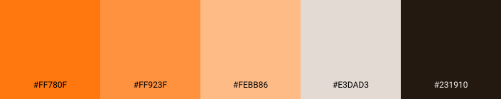

:star2: Ada, code like a girl. A social network to integrate women in tech area. To access click [here](https://social-networl-4387c.web.app/login) :star2:

---

## Index

[1. About](#1-about)

[2. Process](#2-process)

[3. Product](#3-product)

[4. Build With](#4-build-with)

[5. Acknowledgments and credits](#5-acknowledgments-and-credits)

[6. Authors](#6-authors)

## 1. About
:wave: The first known programmer in human history was Augusta Ada King, better known as [Ada Lovelace](https://pt.wikipedia.org/wiki/Ada_Lovelace). Ada developed the first algorithm to be read by a machine, Charles Babbage's analytical machine.

Although this place is historically ours and the lack of TI professionals in the Brazilian market, only 17% of the jobs opportunities in the TI area were offered to women and only 13% of the professionals employed were women and in leadership occupancy, they only represent 8% of the scenario, these numbers references from 2019, according to this [reaserch](https://economia.uol.com.br/noticias/redacao/2020/10/06/mulheres-avancam-na-area-de-tecnologia-mas-diferenca-de-salarios-aumenta.htm?cmpid=copiaecola).

Inspired by the Ada story and our story in Laboratoria, we created Ada, a social network for women in the tech area (or aspiring to) to meet, share support, experiences, opportunities, and knowledge.

## 2. Process

:mag_right: **User experience**

We use part of the [Desing Sprint](https://www.youtube.com/watch?v=aWQUSiOZ0x8&feature=emb_title) method to develop the product, we imagine our proto personas and made the validation by making individuals interviews, then set our user stories, definition of done, and acceptance criteria. :octocat::dancers:

:date: **Planning**

The project planning and organization were developed using the Kanban method. We divided the work by User Stories and the strategy of programming was code review. You can see our board by clicking [here](https://trello.com/b/0PEjsA2s/ada-rede-social). :muscle:

## 3. Product

:bulb: **Branding**

Our name is in honor of Ada Lovelace's story and the square brackets are an interpretation of what this symbol represents in JavaScript. In the code language, they are used to create an array, which means, a group of values saved in one variable, that can be accessed together or individually. In the Ada branding context, they represent the proximity of women and knowledge in one place, that can be access to help, learn or both. 

:bulb: **Visual identity**

The color palette was developed based on orange because in color psychology it symbolized joy and confidence, being a vibrant color, stimulate action and socialization. And also, is a "neutral" color for our society, avoiding the colors stigmatized for the female gender. 

We developed our prototypes based on the [Mobile First](https://medium.com/@Vincentxia77/what-is-mobile-first-design-why-its-important-how-to-make-it-7d3cf2e29d00) concept, we can see all screens by clicking [here](https://www.figma.com/file/67H6oBRw0TqcV3gYmzqInr/Ada-Social-Network?node-id=402%3A2). :iphone:

## 4. Build With

:wrench: Vanilla JavaScript
&nbsp;

:wrench: HTML5
&nbsp;

:wrench: CSS3
&nbsp;

:wrench: Firebase
&nbsp;

## 5. Acknowledgments and credits

[Laboratoria](https://www.laboratoria.la/) :yellow_heart:

## 6. Authors

Developed with :heart: by:

&nbsp;
:princess: [Beatriz Penalva](https://github.com/beatrizpenalva)

&nbsp;
:princess: [Gabrielle Almeida](https://github.com/GabrielleAlmeida)

&nbsp;
:princess: [Julia Terin](https://github.com/JuliaTerin) 
