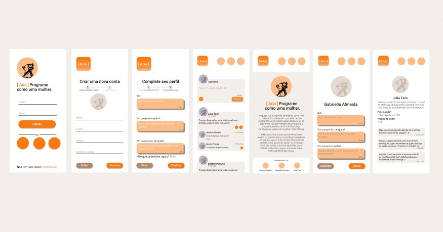
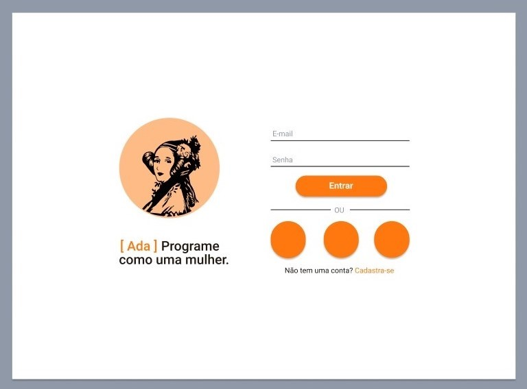
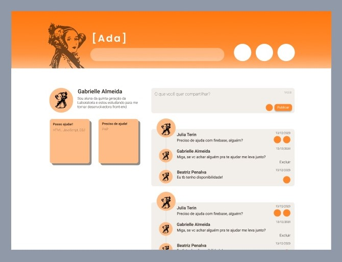
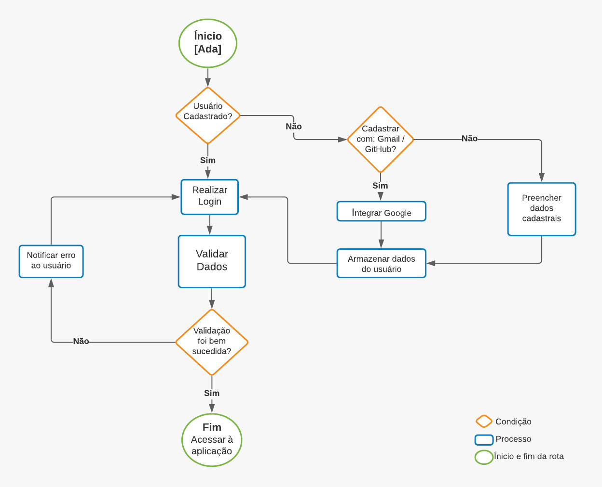

# [Ada]

Uma rede social que visa conectar mulheres que atuam, ou desejam atuar na área de tecnologia, criando assim uma rede de apoio que promove troca de experiências, oportunidades e expanda conhecimento.

---
## Índice

- [1. Introdução](#1-introdução)
- [2. Planejamento e Organização](#2-planejamento-e-organização)
- [3. Processo criativo](#3-processo-criativo)
- [4. Desenvolvimento](#4-desenvolvimento)
- [5. Funcionamento](#5-funcionamento)

---
## 1. Introdução

Rede social desenvolvida em conjunto, pelas alunas/futuras Desenvolvedoras Front-end [Beatriz Penalva](https://github.com/beatrizpenalva), [Gabrielle Almeida](https://github.com/GabrielleAlmeida), [Julia Terin](https://github.com/JuliaTerin) durante o Bootcamp Laboratória - Turma SAP005.

### Sobre 

[Ada] "Programe como uma garota", é mais que uma rede social, é um espaço seguro de compartilhamento de saberes, histórias e aprendizados para mulheres que atuam, ou querem atuar, como desenvolvedoras.

Quem nos inspirou para o desenvolvimento deste projeto foi a  [Augusta Ada King](https://pt.wikipedia.org/wiki/Ada_Lovelace), mais conhecida como Ada Lovelace, considerada a primeira Programadora da História, foi responsável pelo desenvolvimento de um algoritmo que permitiu à máquina analítica de Charles Babbage computar os valores de funções matemáticas.

O propósito desta Rede é auxiliar mulheres na formação umas das outras numa área predominantemente masculina, pois acreditamos que conectadas podemos nos fortalecer e florescer nessa área que historicamente é tão nossa.

---
## 2. Planejamento e Organização

O planejamento e organização do projeto foi feito com método Kanban, utilizando o [Trello](https://trello.com/) como ferramenta. Veja nosso quadro [aqui](https://trello.com/b/0PEjsA2s/ada-rede-social)!

#### Experiência de usuário
Para desenvolver este aplicativo, alguns métodos de UX foram incorporados ao processo:
- Protopersonas
- Protopersonas validadas com entrevistas
- Histórias de usuários

### Personas

  

### Histórias de usuários

Com base nas personas validadas partimos para as histórias de usuários. Geramos quatro histórias, cada uma contemplando necessidades identificadas através das três entrevistas realizadas, assim, gerando etapas de trabalho com as definições de pronto.
As histórias são:

- História 1: "Eu como usuária, desejo ter acesso à aplicação por ser uma mulher com interesse no mundo da tecnologia"
- História 2: "Eu como usuária, desejo criar um perfil para ter acesso a rede de mulheres interessadas em estudar tecnologia"
- História 3: "Eu como usuária, desejo publicar textos para interagir com a rede"
- História 4: "Eu como usuária, desejo visualizar os posts das demais usuárias e poder curtir e responder para interagir com a rede"

Você pode acessar nossas histórias de usuário [1](https://trello.com/c/5bjq1Ybp/15-hist%C3%B3ria-1-eu-como-usu%C3%A1ria-desejo-ter-acesso-%C3%A0-aplica%C3%A7%C3%A3o-por-ser-uma-mulher-com-interesse-no-mundo-da-tecnologia), [2](https://trello.com/c/tn2pc25i/16-hist%C3%B3ria-2-eu-como-usu%C3%A1ria-desejo-criar-um-perfil-para-ter-acesso-a-rede-de-mulheres-interessadas-em-estudar-tecnologia), [3](https://trello.com/c/fmmifLKo/36-hist%C3%B3ria-3-eu-como-usu%C3%A1ria-desejo-publicar-textos-para-interagir-com-a-rede) e [4](https://trello.com/c/CYSdJ3aL/31-hist%C3%B3ria-4-eu-como-usu%C3%A1ria-desejo-visualizar-os-posts-das-demais-usu%C3%A1rias-e-poder-curtir-e-responder-para-interagir-com-a-rede) nos links com os critérios de aceitação e definições de pronto. 

---
## 3. Processo criativo

### Marca

[Ada]
Como já dito, o nome da marca foi baseada na Condessa de Lovelace, seu nome é envolto por colchetes, que na linguagem Javascript são utilizados na declaração de arrays, usada para armazenar vários valores em uma única variável, que podem ser acessados juntos ou separadamente. Seu uso é uma alegoria a junção de pessoas e seus conhecimentos num só lugar, que pode ser acessado para ajudar, aprender ou ambos.

### Cores

A paleta de cores teve como base a cor laranja, na psicologia das cores laranja transmite alegria e confiança, sendo uma cor vibrante que estimula ação, apetite e a socialização. É uma cor de simbologia neutra, evitando o uso de cores estigmatizadas ao feminino. 
 
  

### Protótipo

O processo criativo se deu inicialmente com o desenvolvimento do protótipo criado com a ferramente [Figma](https://www.figma.com/) em mobile first, após pesquisa de cores e estilo.

  
  
  

---
## 4. Desenvolvimento

O desenvolvimento do projeto foi executado em quatro sprints. A primeira foi voltada para o trabalho de UX e UI, onde o tema da rede, o layout, as decisões conceituais e as pesquisas de usuários foram realizados. As demais sprints tiveram como foco o desenvolvimento do código, começando com o login que possibilitasse ao usuário o acesso a rede com sua conta do [Google](https://www.google.com/intl/pt-BR/account/about/), [Facebook](www.facebook.com), [GitHub](GitHubgithub.com) ou um novo registro com validação de email e criação de senha de acesso. Após o acesso a timeline foi desenvolvida contendo áreas de criação de posts, com possibilidade de edição, exclusão e curtida. 
A aplicação foi desenvolvida como um [Single Page Application (SPA)](https://pt.wikipedia.org/wiki/Aplicativo_de_p%C3%A1gina_%C3%BAnica), se utilizando do [Firebase](https://firebase.google.com/) e suas ferramentas. A responsividade foi feita em conjunto com a execução do layout da página, e a interface hospedada usando o [Firebase Hosting](https://firebase.google.com/docs/hosting).

### Tecnológias

Neste projeto foram usados:

<ul>
<li>CSS3</li>
<li>HTML5</li>
<li>Vanilla JavaScript</li>
<li>Firebase Authentication</li>
<li>Cloud Firestore</li>
<li>Visual Studio Code com extenção Node-js</li>
</ul>

## 5. Funcionamento 

A rede social possibilita que mediante o acesso a usuária seja direcionada a sua timeline, onde possa postar, visualizar os posts das demais usuárias e curti-los.

O fluxograma a seguir exemplifica o funcionamento de acesso à aplicação:

  

Após, a usuária acessa sua timeline onde pode criar posts, editar e deletar o mesmo, ver o post das demais usuárias e os curtir, assim como também visualizar o número de curtidas que recebeu em seus posts.

## Acesse aqui a rede social [[Ada]](social-networl-4387c.web.app)

### Desenvolvido por [Beatriz Penalva](https://github.com/beatrizpenalva), [Gabrielle Almeida](https://github.com/GabrielleAlmeida) e [Julia Terin](https://github.com/JuliaTerin) através do Projeto da [Laboratoria](https://www.laboratoria.la/).
